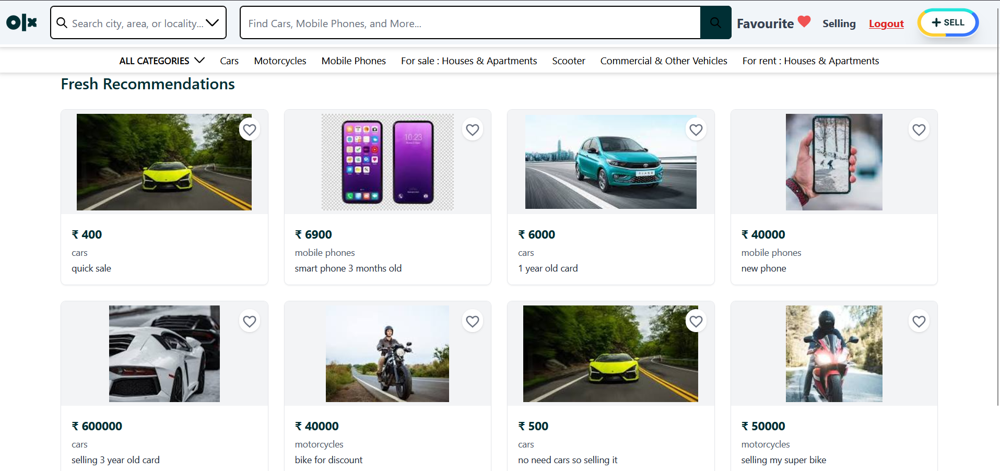
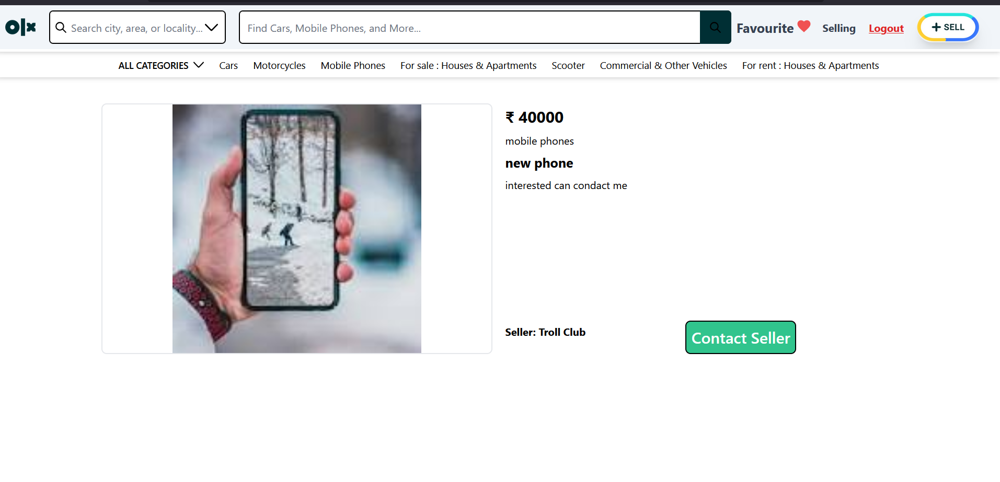
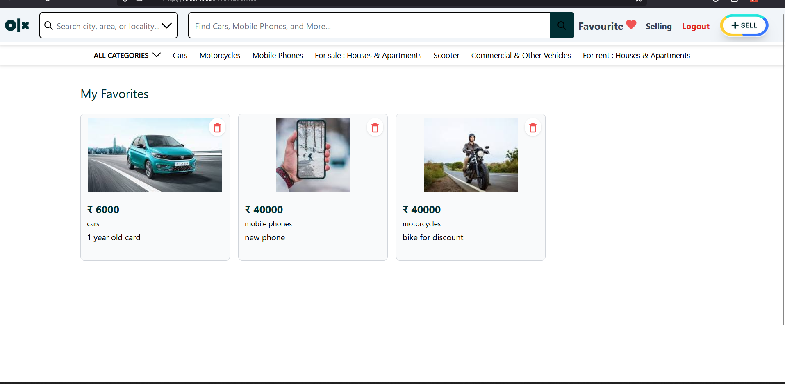

# 🛍️ OLX Clone

An OLX-like marketplace web application built with React and Firebase. This platform allows users to **sign up, list products for sale, add items to their wishlist, remove them, and buy products** — all in a simple, user-friendly interface.

---

## 📸 Screenshots

> Place your screenshots in a `screenshots/` folder and update the image paths accordingly.

---

## 🚀 Features

- 🔐 **User Authentication** – Register/Login via Firebase Auth
- 📤 **Sell Products** – List products with name, description, image, price
- 🛒 **Buy Products** – Browse and buy listed products
- 💖 **Wishlist Management** – Add or remove items from wishlist
- 📁 **Firebase Storage** – Store product images securely
- 🧾 **Product Details Page**
- 🔍 **Search & Filtering** *(if implemented)*

---

## 🛠️ Tech Stack

- **Frontend**: React.js
- **Backend**: Firebase (Firestore, Auth, Storage)
- **UI**: Tailwind CSS

---

